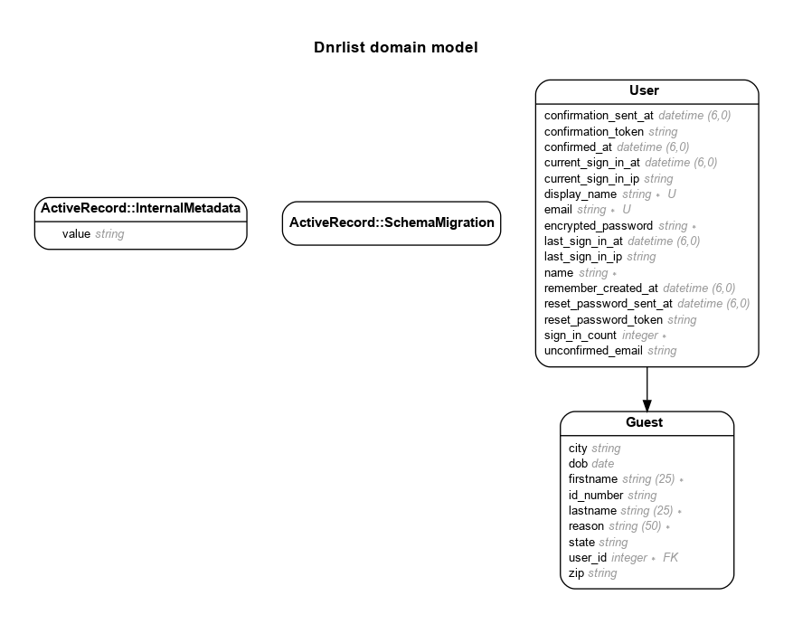

# README

Do Not Rent List for Hotels. Helps hotel staff keep a list of unwanted guests.


Live - https://dnrlist.com

# Model
Generated by Rails ERD. Run rails erd to regenerate (must have graphviz).


# Versions
- ruby 3.1.2p20 (2022-04-12 revision 4491bb740a) [x86_64-linux]
- Rails 7.0.4

# Standard Steps in all my apps:
- In the Gemfile add:
```
gem "rails-erd"
gem "annotate"
```
  In terminal:
  $ bundle install <br>
  $ bundle exec rails g erd:install <br>
  $ rails g annotate:install <br>

- Add Bootstrap: <br>
https://dev.to/overdrivemachines/add-bootstrap-5-and-font-awesome-6-to-rails-7-31b3

- Make JS reload on redirect
```js
document.addEventListener("turbo:load", () => {
  console.log("turbo loaded");
});

```

# References
- JS reload on redirect - https://stackoverflow.com/questions/43583255/script-not-work-after-redirect-in-rails
- respond_to
  - https://api.rubyonrails.org/classes/ActionController/MimeResponds.html
  - https://www.justinweiss.com/articles/respond-to-without-all-the-pain/
- responders
  - https://stackoverflow.com/questions/38600628/undefined-method-respond-to-in-rails-5-controller
  - https://stackoverflow.com/questions/24877075/how-to-include-respond-to-when-you-dont-inherit-from-applicationcontroller-in-r
- Turbo
  - After page load: $('#myModal').modal('show');
  - <%= link_to "Edit", edit_guest_path(guest), data: {turbo_frame: "modal", "bs-toggle": "modal", "bs-target": "#editGuestModal" } ,class: "edit-link" %>
  - https://stackoverflow.com/questions/67315225/how-can-i-execute-javascript-when-a-new-turbo-frame-is-loaded
- How to add turbo frame?
  - Edit Link: link_tag "edit", edit_guest_path(guest), data: { turbo_frame: "modal" }
  - Below Edit Link: <%= turbo_frame_tag "modal-container" %>
  - edit.html.erb:
        <%= turbo_frame_tag "edit-guest-modal-container" do %>
          ...
        <% end %>
  - \_form.html.erb:
    ```erb
    <%= form_with model:guest, data: {turbo_frame: "_top"} do |form| %>
      ...
      <%= link_to "Delete", guest, data: { turbo_method: :delete, turbo_frame: "_top" } %>
      ...
      <%= form.submit "Save", class: "btn btn-primary", id: "btn-save", data: {"bs-dismiss": "modal"} %>
    <% end %>
    ```

- Breaking out of Turbo Frame: https://www.lewisyoul.co.uk/posts/breaking-out-of-turbo-frames
  - turbo_frame: "\_top"

- DELETE method: https://stackoverflow.com/a/71048843/1553074
  - <%= link_to 'Delete', some_path, data: {turbo_method: :delete} %>
  - <%= link_to 'Delete', some_path,
  data: {turbo_method: :delete, turbo_confirm: 'Are you sure?'} %>

- Checkbox: https://moderncss.dev/pure-css-custom-checkbox-style/

# TODO


* System dependencies

* Configuration

* Database creation

* Database initialization

* How to run the test suite

* Services (job queues, cache servers, search engines, etc.)

* Deployment instructions

